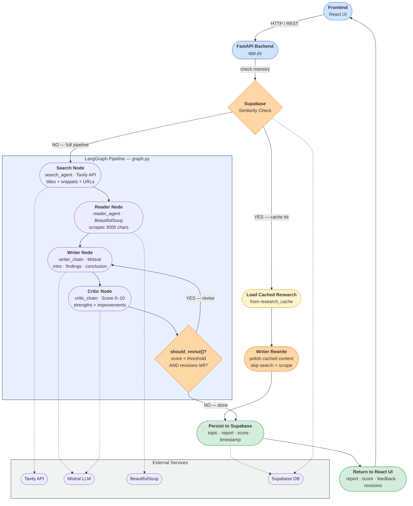
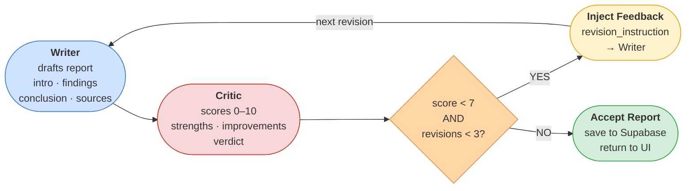

# Multi-Agent Research Agent

A multi-agent AI research pipeline built on **LangGraph** that autonomously searches the web, scrapes sources, writes a structured report, and iteratively critiques and improves it — until it reaches a quality threshold. Features a **React + Vite frontend**, a **FastAPI backend**, and a **Supabase-powered memory layer** that short-circuits expensive web searches for previously researched topics.

**Live Demo:** [https://multi-agent-research-agent.vercel.app/](https://multi-agent-research-agent.vercel.app/)


---

## Features

- **Multi-agent pipeline** — four specialized AI agents (Search, Reader, Writer, Critic) collaborate via a shared state machine
- **Self-improving reports** — the Critic scores each draft; low-scoring reports loop back to the Writer with targeted feedback until the bar is met or the revision cap is hit
- **Supabase semantic cache** — similarity-matches new topics against past research to skip web search and serve polished reports in a fraction of the time
- **React UI** — live node-by-node progress, score display, critic feedback, and downloadable reports
- **FastAPI backend** — orchestrates the LangGraph pipeline and streams state back to the frontend

---

## System Architecture



---

## Critic–Writer Feedback Loop



The Critic's full feedback — every "area to improve" — is injected into the Writer's prompt as `revision_instruction` on each cycle. This loops until the report earns a passing score (default **7/10**) or exhausts the revision budget (default **3 attempts**).

---

## File Structure

```
multi-agent-research-agent/
├── src/
│   ├── App.jsx           # Main React component — UI, SSE streaming, state display
│   └── main.jsx          # React entry point
├── state.py              # ResearchState TypedDict — shared blackboard for all LangGraph nodes
├── tools.py              # web_search (Tavily) and scrape_url (BeautifulSoup) tools
├── agents.py             # Search agent, Reader agent, Writer chain, Critic chain (Mistral)
├── graph.py              # LangGraph state machine — nodes, edges, conditional routing
├── pipeline.py           # CLI runner for testing the pipeline without a UI
├── backend.py            # FastAPI backend — receives topic, orchestrates pipeline, streams state
├── index.html            # Vite HTML entry point
├── vite.config.js        # Vite config — React plugin, dev server on port 3000
├── package.json          # Node dependencies (React, Vite)
├── requirements.txt      # Python dependencies
├── render.yaml           # Render deployment config (backend)
└── .env                  # API keys (see setup below — do not commit)
```

### Key files explained

| File | Role |
|---|---|
| `state.py` | Defines `ResearchState` — the shared `TypedDict` all nodes read from and write to. Holds topic, search results, scraped content, report, feedback, revision counters, and message history. |
| `tools.py` | Two `@tool`-decorated functions: `web_search` hits Tavily (up to 5 results, 300-char snippets); `scrape_url` uses requests + BeautifulSoup to extract up to 3000 chars of clean page text. |
| `agents.py` | Builds four AI actors using `ChatMistralAI (mistral-small-latest)`. The Search and Reader agents use a `bind_tools` agentic loop (up to 5 steps). The Writer and Critic are LangChain chains with structured prompts. |
| `graph.py` | Wires the four nodes into a `StateGraph`. The `should_revise()` conditional edge routes back to the Writer if `score < threshold` and `revision_num < max_revisions`, otherwise ends. |
| `pipeline.py` | Thin CLI wrapper — constructs the initial state and calls `research_graph.invoke()`. Useful for testing without a UI. |
| `backend.py` | FastAPI app — receives topic from the React frontend, runs the Supabase cache check, invokes the pipeline (or fast path), and streams state back via SSE. |
| `src/App.jsx` | React frontend — connects to the backend SSE stream, renders live agent progress, scores, critic feedback, and the final report. |

---

## Agent Roles

### Search Agent
Calls the Tavily API with the research topic and returns up to 5 results with titles, URLs, and short snippets.

### Reader Agent
Selects the most promising URLs from search results and uses BeautifulSoup to scrape up to 3000 characters of clean body text, stripping scripts, styles, navbars, and footers.

### Writer Chain
Uses a structured prompt to produce a report with four sections: **Introduction**, **Key Findings**, **Conclusion**, and **Sources**. On revision runs, the full critic feedback is injected as a `revision_instruction` and the Writer is told which revision number it is.

### Critic Chain
Returns a structured critique containing a `Score: X/10`, a list of strengths, areas to improve, and a one-line verdict. The score is parsed with a multi-pattern regex to handle varied Mistral output formatting.

---

## Supabase Memory Layer

Before any pipeline work begins, the system queries the `research_cache` table for a same or semantically related topic using fuzzy/embedding similarity.

- **Cache hit** → load cached report and content, send directly to Writer for a rewrite and polish. Web search and scraping are skipped entirely.
- **Cache miss** → run full pipeline. Once complete, save `topic + report + score + timestamp` to Supabase for future queries.

This is the most impactful optimization in the system — web search + scraping is the slowest and most expensive step, so cache hits deliver polished reports in a fraction of the time.

**Table schema (`research_cache`):**

| Column | Type | Description |
|---|---|---|
| `id` | uuid | Primary key |
| `topic` | text | Research topic string |
| `report` | text | Final report markdown |
| `score` | int | Critic score (0–10) |
| `timestamp` | timestamptz | When the research was saved |

---

## Getting Started

### Prerequisites

- Python 3.10+
- Node.js 18+ (for the React frontend)
- A Supabase project with the `research_cache` table created
- API keys for Tavily, Mistral, and Supabase

### 1. Clone the repo

```bash
git clone https://github.com/dramaaa98/multi-agent-research-agent.git
cd multi-agent-research-agent
```

### 2. Install Python dependencies

```bash
pip install -r requirements.txt
```

### 3. Install frontend dependencies

```bash
npm install
```

### 4. Configure environment variables

Copy `env.example` to `.env` and fill in your keys:

```env
TAVILY_API_KEY=your_tavily_key
MISTRAL_API_KEY=your_mistral_key
SUPABASE_URL=your_supabase_project_url
SUPABASE_KEY=your_supabase_anon_key
```

### 5. Run the backend

```bash
python -m uvicorn backend:app --reload --port 8000
```

### 6. Run the frontend

In a second terminal:

```bash
npm run dev
```

The frontend will be available at [http://localhost:3000](http://localhost:3000). It connects to the backend at `http://localhost:8000` by default.

### 7. Run the pipeline via CLI (optional, for testing)

```bash
python pipeline.py
```

---

## Deployment

The app is split into two separately deployed services:

| Service | Platform | URL |
|---|---|---|
| Frontend (React + Vite) | Vercel | [https://multi-agent-research-agent.vercel.app/](https://multi-agent-research-agent.vercel.app/) |
| Backend (FastAPI) | Render | [https://multi-agent-research-agent.onrender.com](https://multi-agent-research-agent.onrender.com) |

### Deploy backend to Render

The repo includes a `render.yaml` config. Connect the repo to Render and it will auto-detect the config. Set the following environment variables in the Render dashboard:

```
TAVILY_API_KEY
MISTRAL_API_KEY
SUPABASE_URL
SUPABASE_KEY
```

### Deploy frontend to Vercel

1. Connect the repo to Vercel
2. Set the following environment variable in the Vercel dashboard:

```
VITE_API_BASE_URL=https://multi-agent-research-agent.onrender.com
```

3. Vercel will auto-detect the Vite config and run `npm run build`

> **Note:** Make sure `node_modules/` is in your `.gitignore` and not committed to the repo — Vercel installs its own dependencies during the build.

---

## Tech Stack

| Layer | Technology |
|---|---|
| LLM | Mistral AI (`mistral-small-latest`) |
| Agent framework | LangGraph + LangChain |
| Web search | Tavily API |
| Web scraping | requests + BeautifulSoup4 |
| Memory / cache | Supabase (PostgreSQL) |
| Backend | FastAPI |
| Frontend | React + Vite |
| Backend hosting | Render |
| Frontend hosting | Vercel |

---

## Configuration

Key parameters that control pipeline behaviour (set in initial state or `.env`):

| Parameter | Default | Description |
|---|---|---|
| `max_revisions` | `3` | Maximum Writer–Critic revision cycles |
| `score_threshold` | `7` | Minimum critic score (out of 10) to accept a report |
| `similarity_threshold` | configurable | Supabase similarity score above which a cache hit is declared |

---
